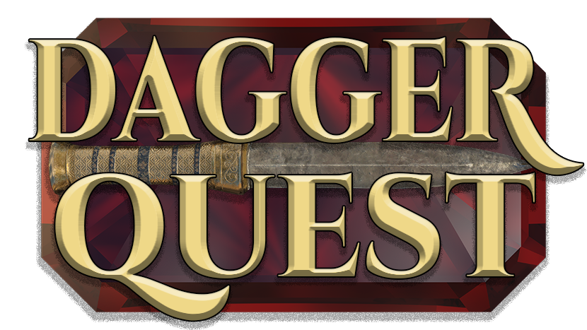

A 2D Action RPG made in [Construct 3](https://www.construct.net/). Embark on an epic adventure filled with quests, combat, and exploration in this classic-style ARPG.

## ⚔️ Play Now

**Play DaggerQuest at: [DaggerQuest.com](https://daggerquest.com/)**

## 📖 About

*DaggerQuest* is a 2D Action Role-Playing Game that combines classic ARPG mechanics with modern gameplay elements. Explore dungeons, battle enemies, collect loot, and complete quests in a rich fantasy world.

## 🎯 Features

- Play in your browser! Classic 2D ARPG gameplay
- Character progression and skill systems
- Inventory management and equipment
- Quest system with engaging storylines (coming soon!)
- Dungeon exploration and combat
- Loot collection and (coming soon!) crafting

## 🛠️ Development

This repository contains the source code for DaggerQuest, built using Construct 3. The game is developed by [Laserwolve Games](https://www.laserwolvegames.com/). Contribution is welcomed; submit a Pull Request!

### Related Repositories

- [**Overlord**](https://github.com/Laserwolve-Games/Overlord) - An render pipeline management tool used to generated assets for *DaggerQuest*.
- [**CAFfeine**](https://github.com/Laserwolve-Games/CAFfeine) - An automation and testing framework for *DaggerQuest* and Construct 3 in general.
- [**Plains of Shinar**](https://github.com/Laserwolve-Games/PlainsOfShinar) - An attempt at porting *DaggerQuest* to Pixi.js.

## 🧙‍♂️ Updates

*DaggerQuest* is automatically deployed to [DaggerQuest.com](https://daggerquest.com/) when a new version is released.

## ✒️ License

This project is licensed under the [AGPL 3.0 License](https://www.gnu.org/licenses/agpl-3.0.html.en) - see the [LICENSE](LICENSE) file for details.